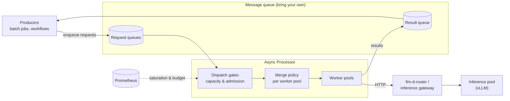
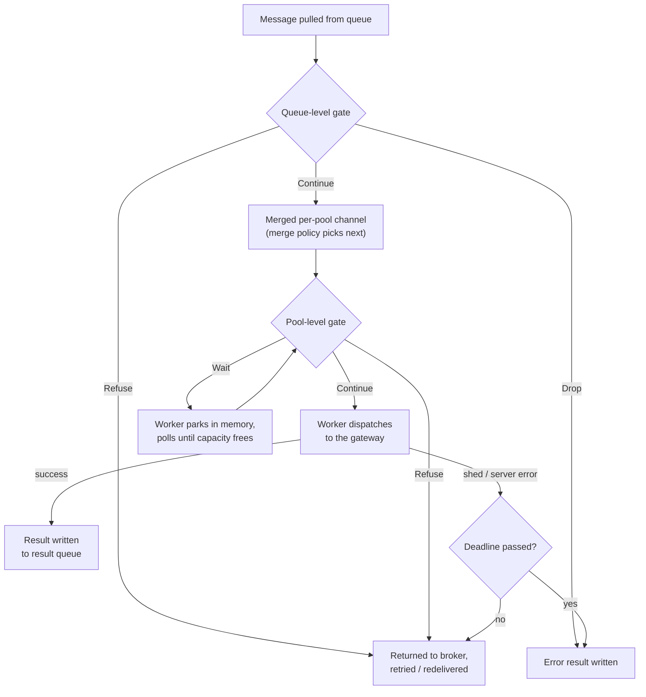
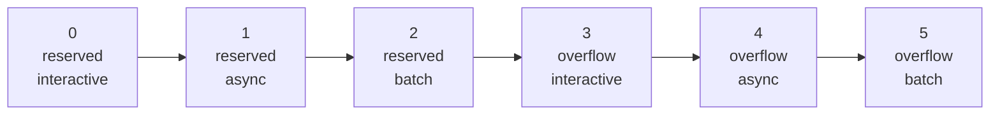
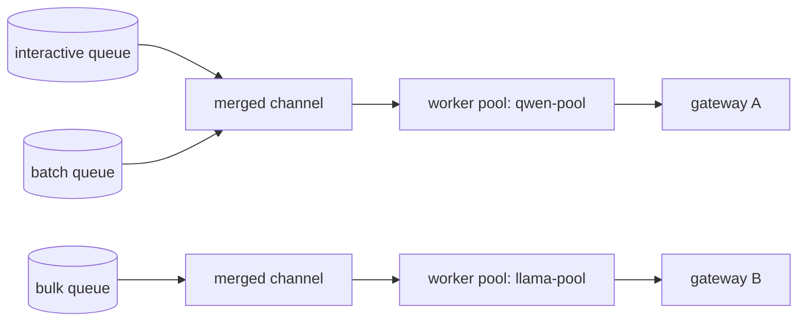

# Async Processor (AP) - User Guide

## Overview
**The Problem:** High-performance accelerators often suffer from low utilization in strictly online serving scenarios, or users may need to mix latency-insensitive workloads into slack capacity without impacting primary online serving.

**The Value:** This component enables efficient processing of requests where latency is not the primary constraint (i.e., the magnitude of the required SLO is ≥ minutes). <br>
By utilizing an asynchronous, queue-based approach, users can perform tasks such as product classification, bulk summarizations, summarizing forum discussion threads, or performing near-realtime sentiment analysis over large groups of social media tweets without blocking real-time traffic.

**Architecture Summary:** The Async Processor is a composable component that provides services for managing these requests. It functions as an asynchronous worker that pulls jobs from a message queue and dispatches them to `llm-d-router` (or another inference gateway), decoupling job submission from immediate execution.



## When to Use
• **Latency Insensitivity:** Suitable for workloads where immediate response is not required.

• **Capacity Optimization:** Useful for filling "slack" capacity in your inference pool.


## Design Principles

The architecture adheres to the following core principles:

1. **Bring Your Own Queue (BYOQ):** All aspects of prioritization, routing, retries, and scaling are decoupled from the message queue implementation.

2. **Composability:** The end-user does not interact directly with the processor via an API. Instead, the processor interacts solely with the message queues, making it highly composable with offline batch processing and asynchronous workflows.

3. **Resilience by Design:** If real-time traffic spikes or errors occur, the system triggers intelligent retries for jobs, ensuring they eventually complete without manual intervention.


## Documentation

The full reference lives in `docs/`, one page per topic:

| Page | Contents |
| --- | --- |
| [Transports](docs/transports.md) | Transport configuration, queue/topic entry fields, backend compatibility, and the per-implementation reference (`redis-sortedset`, `redis-pubsub`, `gcp-pubsub`) |
| [Dispatch Gates](docs/gates.md) | Budget, admission, and combinator gates — every `gate_type` and its parameters |
| [Worker Pools and Merge Policies](docs/worker-pools.md) | Pool configuration and the request merge policy reference (`random-robin`, `tier-priority`) |
| [Requests and Results](docs/requests-and-results.md) | Request/result message formats, the internal wire envelope, and request body transforms |
| [Observability](docs/observability.md) | Prometheus metrics (with a PromQL cookbook) and OpenTelemetry tracing |
| [Command Line Parameters](docs/reference/cli.md) | Full flag reference |

Task-oriented guides are under [`docs/guides/`](docs/guides/), including the
[end-to-end GKE deployment guide](docs/guides/e2e-deploy.md).

## Concepts

Short orientation topics. Each links to its full reference page under `docs/`.

### Transports

The transport is the message queue backend the processor pulls requests from and writes results to. Three implementations are available: `redis-pubsub` (ephemeral Redis channels), `redis-sortedset` (persisted, priority-sorted Redis — recommended for production), and `gcp-pubsub` (GCP Pub/Sub). The transport is selected with `--transport` and configured with a single JSON document. Redis-protocol-compatible backends such as Valkey work unchanged (see [Backend Compatibility](docs/transports.md#backend-compatibility)). → [Transport Configuration](docs/transports.md#transport-configuration)

### Queues, Topics, and Worker Pools

Each queue (Redis) or topic (GCP Pub/Sub) entry in the transport config names the gateway it dispatches to (`igw_base_url`), the request path, an optional inference objective, and the worker pool that serves it (`worker_pool_id`). A worker pool has a fixed number of workers; each worker holds one in-flight request for its full duration, so pool concurrency caps throughput by Little's Law — tune it to your backend's latency/throughput target (see the [Async Processor Operations Guide](https://github.com/llm-d/llm-d/blob/main/docs/operations/async-processor.md)). Multiple queues can share a pool. → [Worker Pools Configuration](docs/worker-pools.md#worker-pools-configuration)

### Dispatch Gates

A gate decides whether a message pulled from the broker may be dispatched right now, based on system capacity or admission policy. Gates run at two levels:

* **Queue-level gates** run at the admission phase for a specific queue. When a queue-level gate denies admission (returning `ActionRefuse`), the request is immediately returned to the broker to be retried/re-delivered, freeing the worker to process other queues.
* **Pool-level gates** run directly inside the worker loop to regulate capacity constraints shared by all queues routing to that worker pool. When a pool-level gate returns `ActionWait`, the worker parks in-memory and polls until capacity is available, avoiding broker nack/retry overhead. If the pool-level gate returns `ActionRefuse`, the request is immediately returned to the broker.

Gates come in two flavors: **budget gates** report a fraction of available capacity in [0, 1] (e.g. the `prometheus-*` gates), and **admission gates** issue a per-message verdict — continue, wait, refuse, or drop (e.g. `redis-quota`, `tier-priority-admission`). Combinator gates (`composite`, `wait-on-refuse`) assemble them. → [Dispatch Gate Reference](docs/gates.md#dispatch-gate-reference)

A request's path through the gates, from broker to result:



### Reserved and Overflow

Quota gates can run in *classifying* mode: instead of blocking a message that exceeds its quota, they tag it with a classification label — `reserved` (within quota) or `overflow` (over quota). Downstream components then act on the tag: the `tier-priority` merge policy buckets reserved traffic ahead of overflow traffic, and the `tier-priority-admission` gate parks reserved requests but sheds overflow requests when the pool is saturated. A message with no classification is treated as overflow by the merge policy. The `redis-quota` gate classifies when `gating_mode` is set to `classifying`.

### Tiers and Priority Lanes

Queues declare an SLA tier through their `labels` (label key configurable via `tier_label`, default `"tier"`), with values `interactive`, `async`, or `batch`. Combining classification × tier yields six strict priority lanes, ordered:



Lane 0 is dispatched first, lane 5 last. A missing or unrecognized tier falls to `batch`; a missing classification falls to overflow. The `tier-priority` merge policy dispatches strictly by lane order and round-robins within a lane.

### Request Merge Policies

The processor consumes from multiple queues concurrently. A merge policy merges messages from all active queues — not globally, but **per worker pool**: input channels are grouped by `worker_pool_id` and each pool gets its own independent merged channel. This gives complete backpressure isolation: a slow or saturated pool blocks only its own merged channel. Two policies exist: `random-robin` (default) and `tier-priority`. Both can stamp a fairness-identity header for the gateway's flow control. → [Request Merge Policy Reference](docs/worker-pools.md#request-merge-policy-reference)



A saturated `llama-pool` above blocks only its own merged channel — `qwen-pool` keeps dispatching.

### Retries and Deadlines

Every request message carries a mandatory `deadline` (Unix seconds). When processing fails — shed by a gate or a server-side error — the message is scheduled for a retry with exponential backoff, as long as the deadline has not passed. A message whose deadline passes produces a `DEADLINE_EXCEEDED` error result.

### Request Body Transforms

By default the worker dispatches the OpenAI-style JSON marshalled from a request's `payload`. Body-transform plugins rewrite the outgoing body and `Content-Type` based on per-message `metadata` — for example turning JSON into `multipart/form-data` for Whisper-style endpoints. The default JSON path is preserved byte-for-byte when no plugin applies. → [Request Body Transform Reference](docs/requests-and-results.md#request-body-transform-reference)

### Results

For each request, a result message keyed by the request `id` is written to the result queue/topic — carrying the HTTP status and response payload on success, or an error code and message on failure. → [Result Messages](docs/requests-and-results.md#result-messages)

## Deployment

To deploy the Async Processor into your K8S cluster, follow these steps:
- Create an `.env` file with `export` statements overrides. E.g.:
```bash
IMAGE_TAG_BASE=<if needed to override for a private registry>
DEPLOY_LLM_D=false
DEPLOY_REDIS=false
DEPLOY_PROMETHEUS=false
AP_IMAGE_PULL_POLICY=Always
```
- Run:
```bash
make deploy-ap-on-k8s
```
- To test a request (only for the Redis implementation):
    - Subscribing to the result channel (different terminal window):
    ```bash
       export REDIS_IP=....
       kubectl run -i -t subscriberbox --rm --image=redis --restart=Never -- /usr/local/bin/redis-cli -h $REDIS_IP SUBSCRIBE result-queue
    ```
    - Publishing a request:
    ```bash
       export REDIS_IP=....
       kubectl run --rm -i -t publishmsgbox --image=redis --restart=Never -- /usr/local/bin/redis-cli -h $REDIS_IP PUBLISH request-queue '{"id" : "testmsg", "payload":{ "model":"food-review-1", "prompt":"Hi, good morning "}, "deadline" :23472348233323 }'
     ```

## Development

A setup based on a KIND cluster with a Redis server for MQ is provided.
In order to deploy everything run:

```bash
make deploy-ap-emulated-on-kind
```

Then, in a new terminal window register a subscriber:

```bash
kubectl exec -n redis redis-master-0 -- redis-cli SUBSCRIBE result-queue
```

Publish a message for async processing (uses the [internal wire format](docs/requests-and-results.md#internal-wire-format) since this bypasses the producer):

```bash
kubectl exec -n redis redis-master-0 -- redis-cli PUBLISH request-queue '{"request_kind":"plain","data":{"id":"testmsg","created":1764044000,"deadline":9999999999,"payload":{"model":"unsloth/Meta-Llama-3.1-8B","prompt":"hi"}}}'
```
